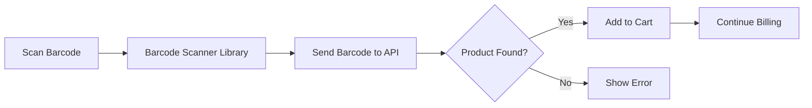
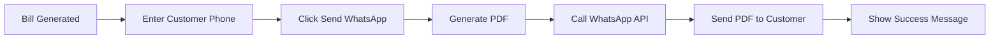
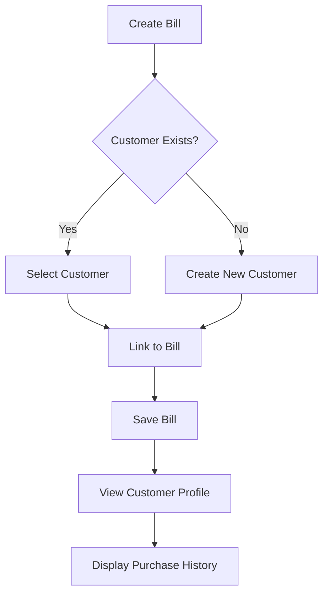
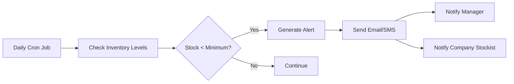
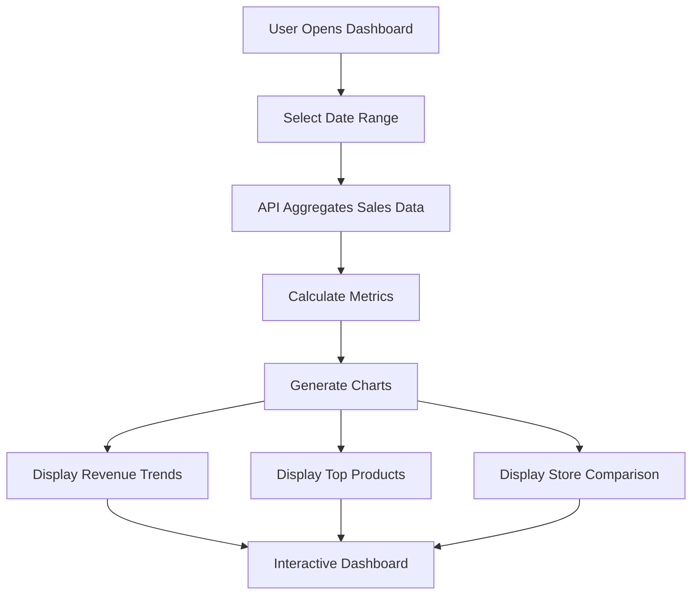

# Future Enhancements

This document outlines 5 simple future enhancements for the RetailPulse system with their implementation approach.

---

## 1. Barcode Scanner Integration

**Description:**  
Enable quick product search and billing using barcode scanners for faster checkout.

**Implementation:**
- Add barcode field to Product schema
- Integrate barcode scanner library (e.g., QuaggaJS for web)
- Create barcode input API endpoint that searches products by barcode
- Update Sales UI with barcode scan button
- Auto-add scanned products to cart

**Workflow:**

---

## 2. WhatsApp Bill Sharing

**Description:**  
Send bill PDFs directly to customers via WhatsApp after purchase.

**Implementation:**
- Integrate WhatsApp Business API or third-party service (e.g., Twilio)
- Add customer phone number field in billing form (optional)
- Generate bill PDF using existing system
- Create API endpoint to send PDF via WhatsApp
- Add "Send via WhatsApp" button on bill confirmation screen

**Workflow:**

---

## 3. Customer Management

**Description:**  
Store customer contact details and view their complete purchase history.

**Implementation:**
- Create Customer schema (name, phone, email, address)
- Add customer selection/creation in billing flow
- Link bills to customer records via foreign key
- Create Customer Management page for CRUD operations
- Build customer profile page showing all past bills
- Add search and filter functionality

**Workflow:**

---

## 4. Low Stock Alerts

**Description:**  
Automatic notifications when products fall below minimum stock level.

**Implementation:**
- Add minimum_stock_level field to Product schema
- Create background job/cron to check stock levels daily
- Integrate email service (e.g., SendGrid) or SMS service
- Build notification template for low stock alerts
- Send alerts to Store Manager and Company Stockist
- Add notification preferences in user settings

**Workflow:**

---

## 5. Sales Analytics Dashboard

**Description:**  
Visual dashboard showing sales trends, top products, and revenue insights.

**Implementation:**
- Create analytics API endpoints aggregating sales data
- Use charting library (e.g., Chart.js or Recharts)
- Build dashboard page with key metrics:
  - Total sales and revenue (daily/weekly/monthly)
  - Top selling products
  - Sales by product category
  - Store-wise performance comparison
- Add date range filters
- Role-based access (Company Admin sees all stores, Manager sees own store)

**Workflow:**

