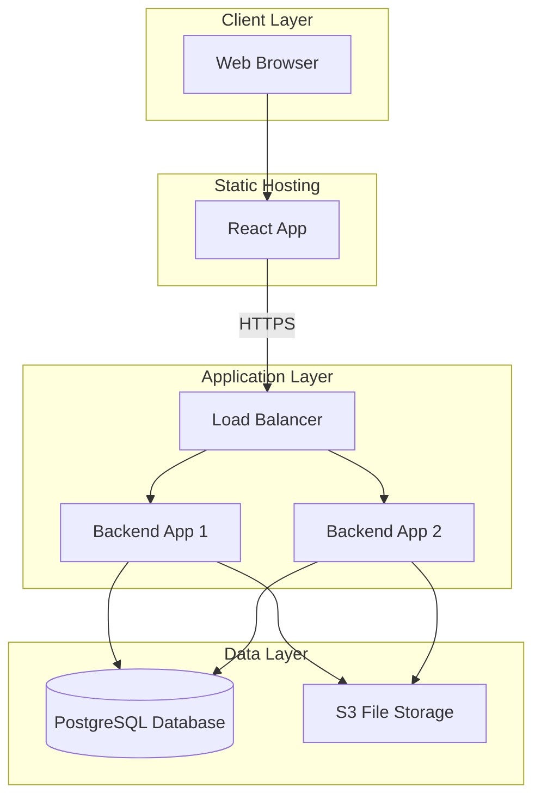
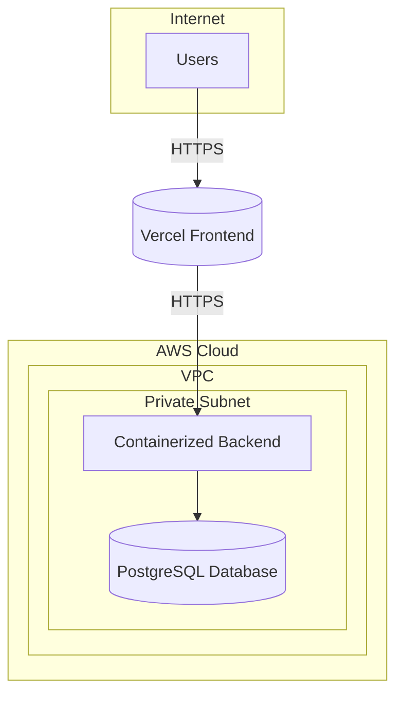

# Architecture

## System Architecture Overview

RetailPulse is a standard web application with three layers:

1.  **Frontend**: A React application that users see in their web browser.
2.  **Backend**: A FastAPI application that contains all the business logic.
3.  **Database**: A PostgreSQL database that stores all the data.

---

## High-Level Architecture Diagram

This diagram shows how the parts of the system connect.

---

## AWS-Specific Architecture Diagram

This diagram shows a simplified view of the system hosted on AWS, with the frontend on Vercel.

