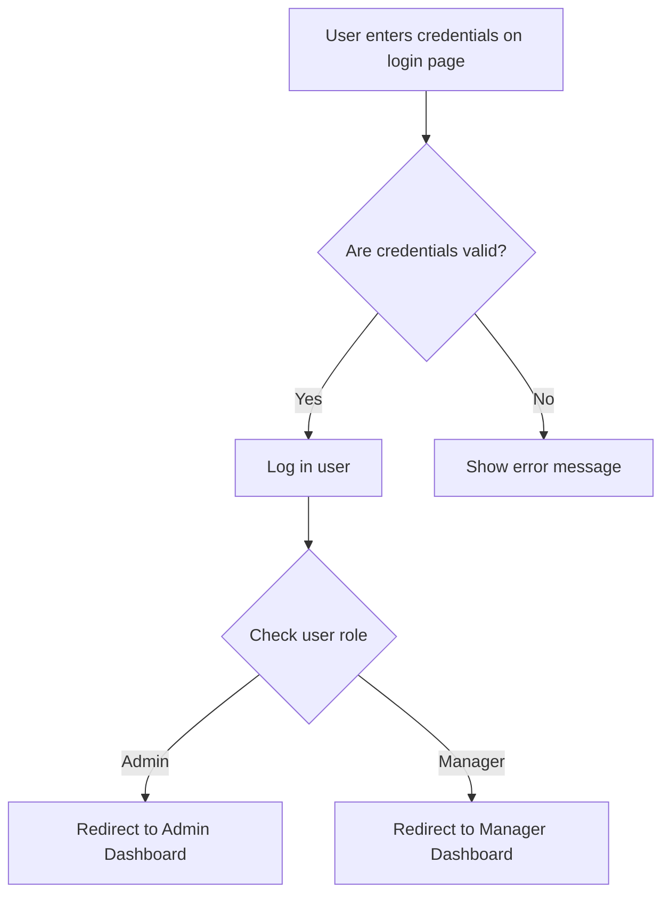

# Authentication and Authorization

## Authentication Flow

A user enters their username and password on the login page. The system checks if the credentials are correct. If they are, the user is logged in and can access the app. If not, an error message is shown.

## Authorization Rules

The system uses Role-Based Access Control (RBAC) to decide who can do what.

| Action | Manager | Admin |
|---|---|---|
| Create Bills | Yes | Yes |
| View Own Bills | Yes | Yes |
| View All Bills | No | Yes |
| View Analytics | No | Yes |
| Add/Edit Products | No | Yes |
| Manage Users | No | Yes |
