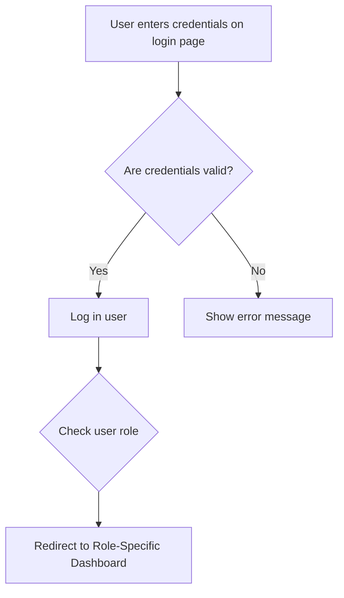

# Authentication and Authorization

## Authentication Flow

A user enters their username and password on the login page. The system checks if the credentials are correct. If they are, the system identifies their role and redirects them to the appropriate dashboard. If not, an error message is shown.

## Authorization Rules

The system uses a granular Role-Based Access Control (RBAC) model to enforce permissions. A user's role determines what they can see and do, and their assigned store (if any) limits the scope of their actions.

Below is a summary of the permissions for each role.

| Action                        |             Company Admin              |             Store Manager              |                Stockist                |            Company Stockist            |                 Sales                  |
| ----------------------------- | :------------------------------------: | :------------------------------------: | :------------------------------------: | :------------------------------------: | :------------------------------------: |
| **Store Management**          |                                        |                                        |                                        |                                        |                                        |
| Create/Edit Stores            | Yes |  No   |  No   |  No   |  No   |
| **User Management**           |                                        |                                        |                                        |                                        |                                        |
| Create/Edit Users             | Yes |  No   |  No   |  No   |  No   |
| **Product Master List**       |                                        |                                        |                                        |                                        |                                        |
| Create/Edit Products          | Yes |  No   |  No   |  No   |  No   |
| **Inventory**                 |                                        |                                        |                                        |                                        |                                        |
| View Own Store Inventory      | Yes | Yes | Yes | Yes | Yes |
| View All Stores' Inventory    | Yes |  No   | Yes |  No   |  No   |
| Add/Edit Own Store Inventory  |  No   |  No   | Yes | Yes |  No   |
| **Billing**                   |                                        |                                        |                                        |                                        |                                        |
| Create/Edit Bills (own store) |  No   |  No   |  No   |  No   | Yes |
| View Bills (own store)        | Yes | Yes |  No   |  No   | Yes |
| View Bills (all stores)       | Yes |  No   |  No   |  No   |  No   |
