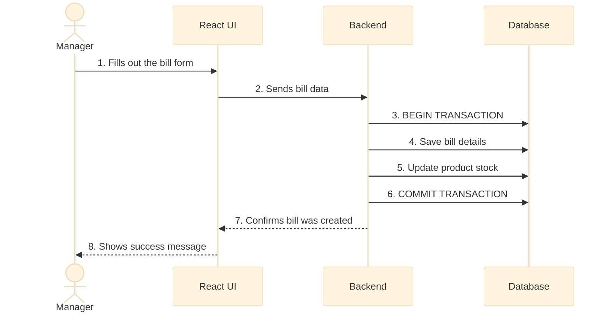
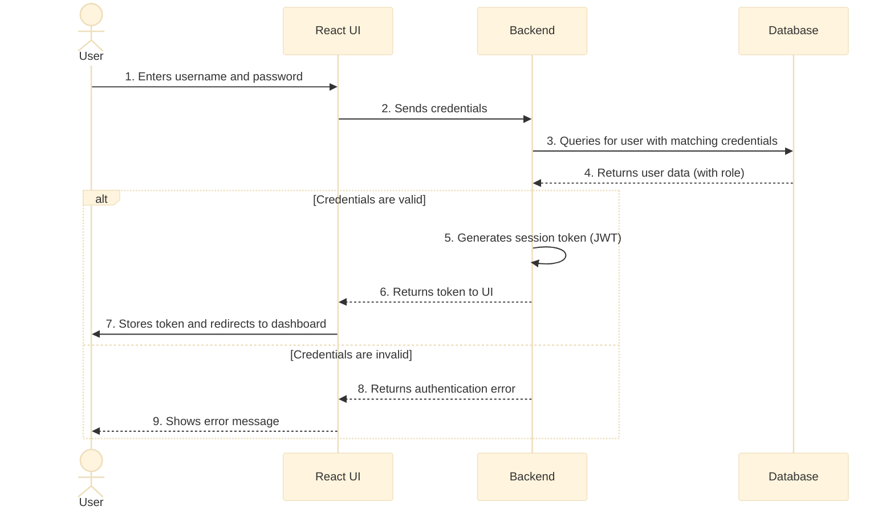
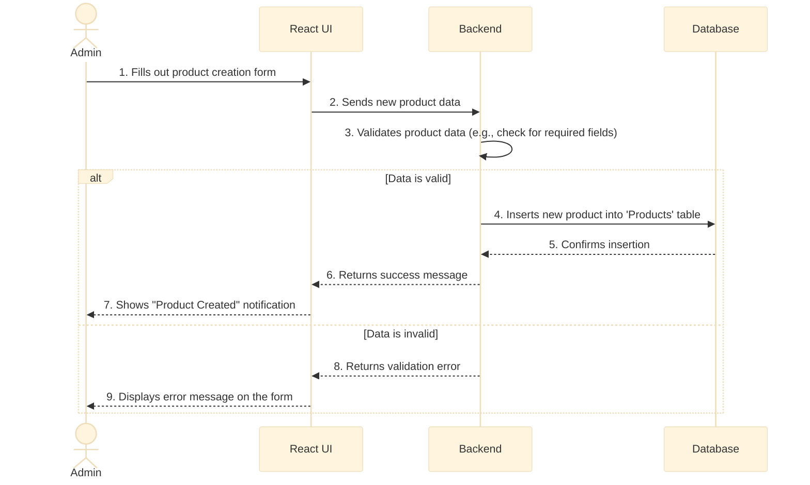
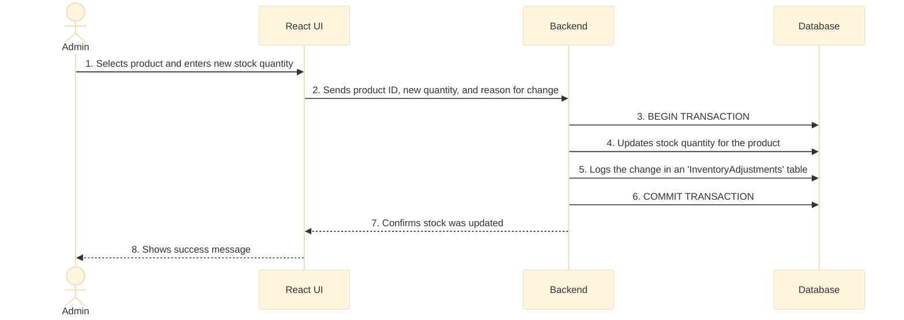
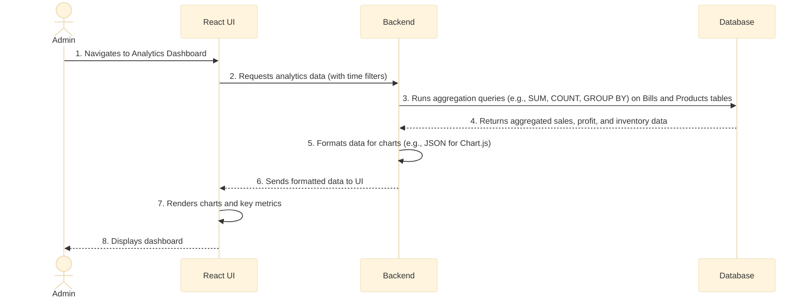
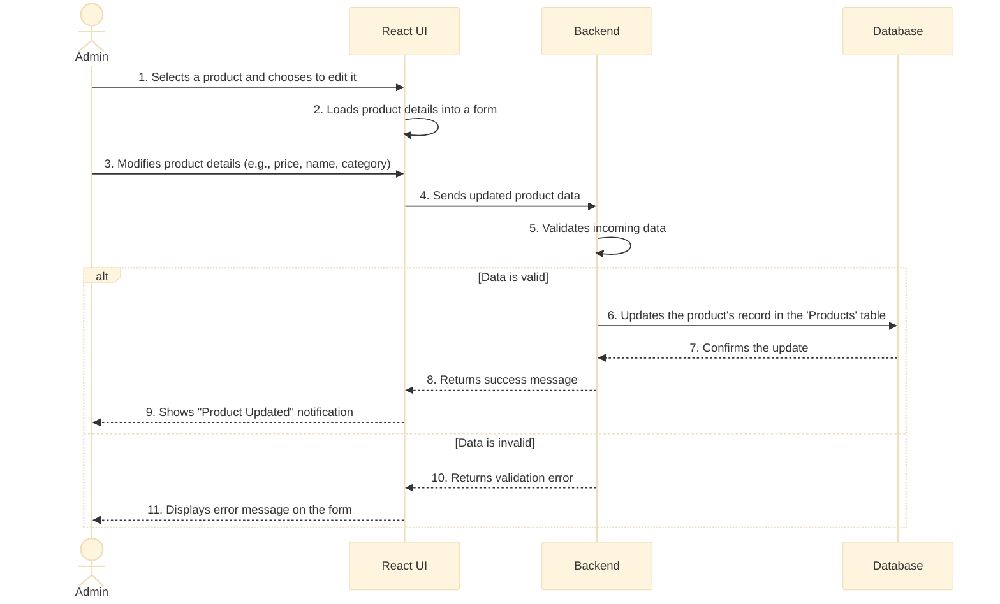

# Data Flow Diagrams

## 1. Bill Creation Flow

This shows the steps for creating a bill.

## 2. User Login Flow

This diagram shows how a user logs in and gets a session token.

## 3. Product Creation Flow

This flow describes how an Admin adds a new product to the inventory.

## 4. Inventory Update Flow

This diagram shows how an Admin manually adjusts the stock for a product.

## 5. Analytics Dashboard Data Flow

This shows how the analytics dashboard gets its data.

## 6. Product Details Update Flow

This diagram shows how an Admin updates the core details of a product, such as its price or description.

