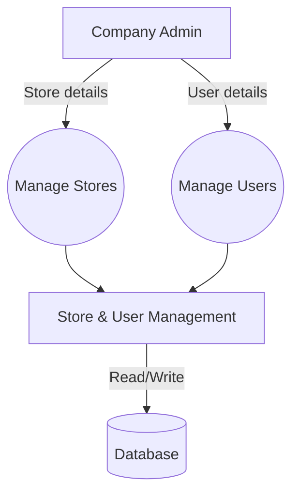
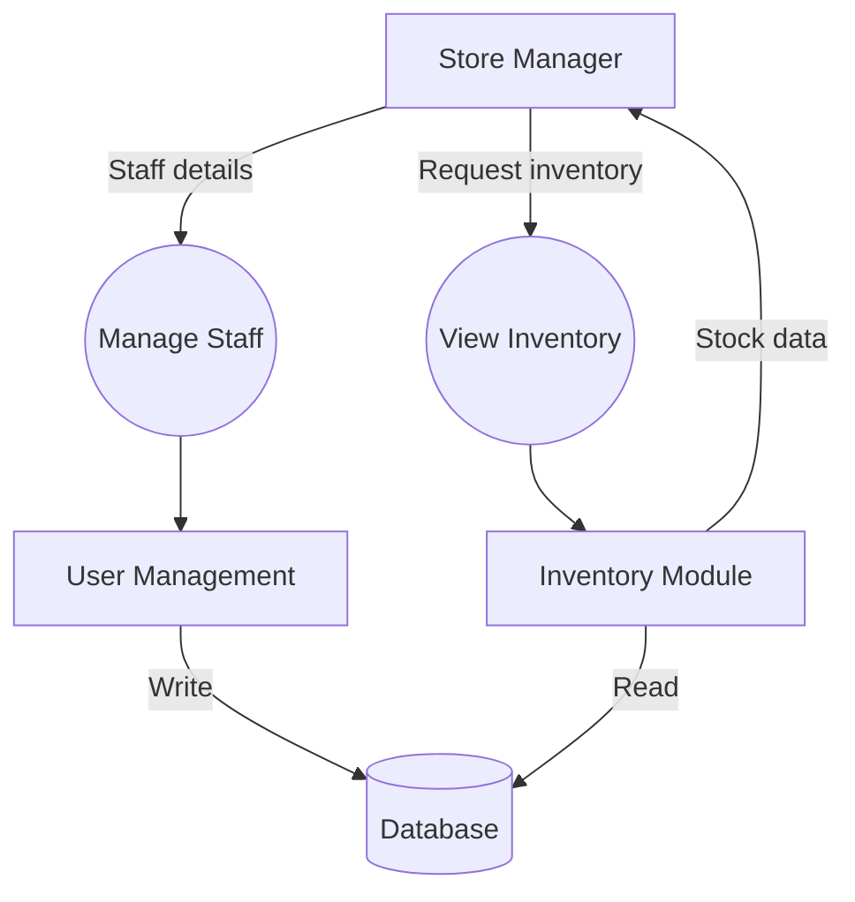
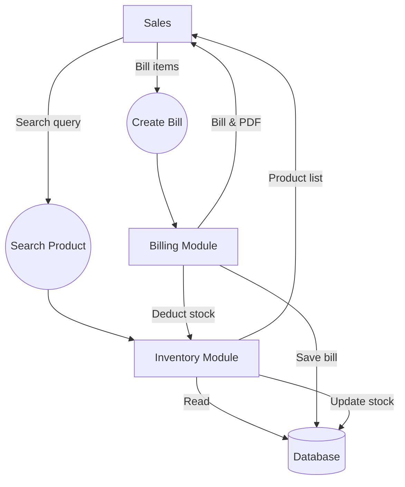
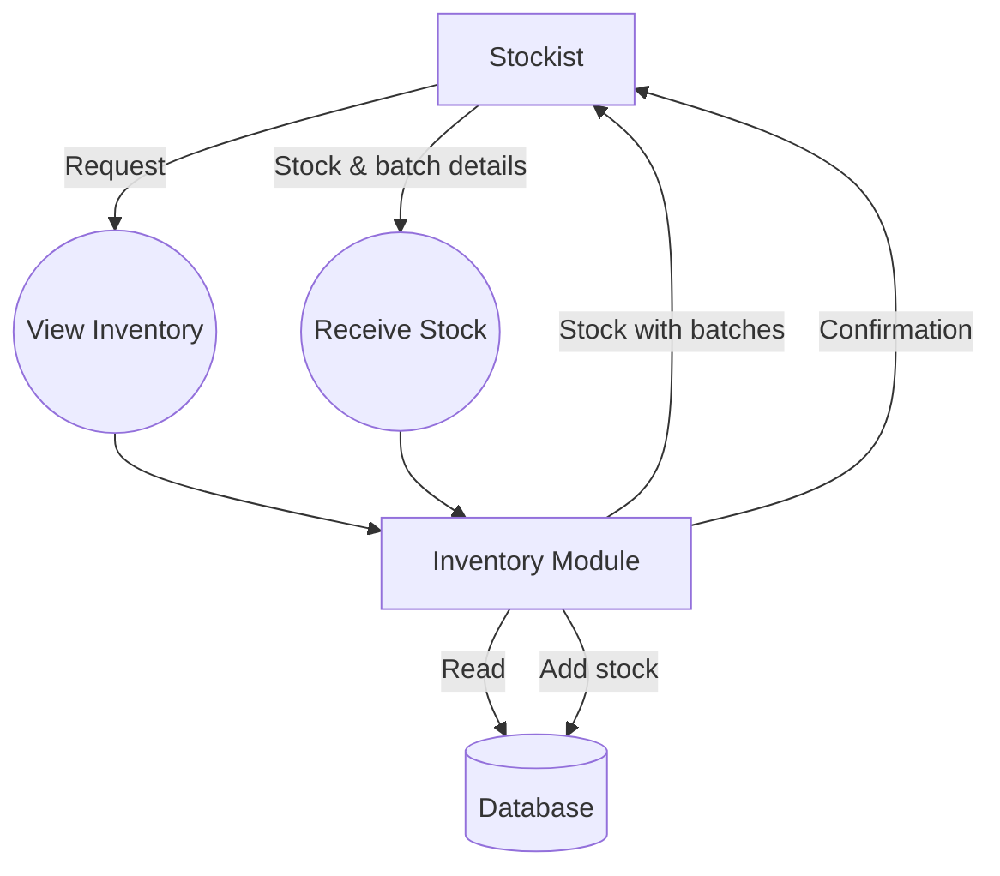
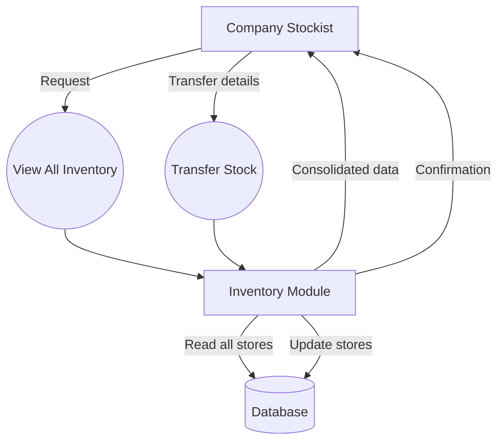

# System Data Flow

This document shows detailed data flow diagrams for each user role in the RetailPulse system.

---

## 1. Company Admin Data Flow

The Company Admin manages the entire system, including stores and users.

**Key Functions:**
- Manage all stores (create, edit, delete)
- Manage all users across stores

---

## 2. Store Manager Data Flow

The Store Manager oversees a specific store, manages store staff, and views store-level inventory.

**Key Functions:**
- Manage store staff (create Sales, Stockist users)
- View store inventory levels

---

## 3. Sales Data Flow

The Sales user creates bills, searches for products, and handles customer transactions.

**Key Functions:**
- Search for products
- Create customer bills and generate PDF
- Automatic inventory deduction

---

## 4. Stockist Data Flow

The Stockist manages local store inventory, receives stock, and updates quantities.

**Key Functions:**
- View store inventory with batch details
- Receive and add new stock with expiry dates

---

## 5. Company Stockist Data Flow

The Company Stockist oversees inventory across all stores and manages inter-store transfers.

