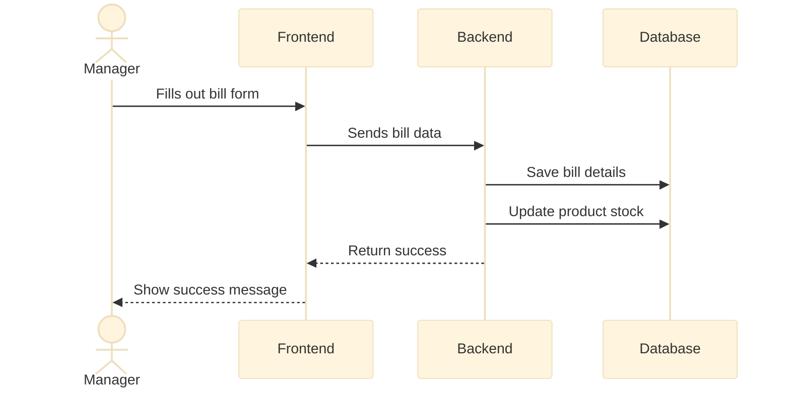
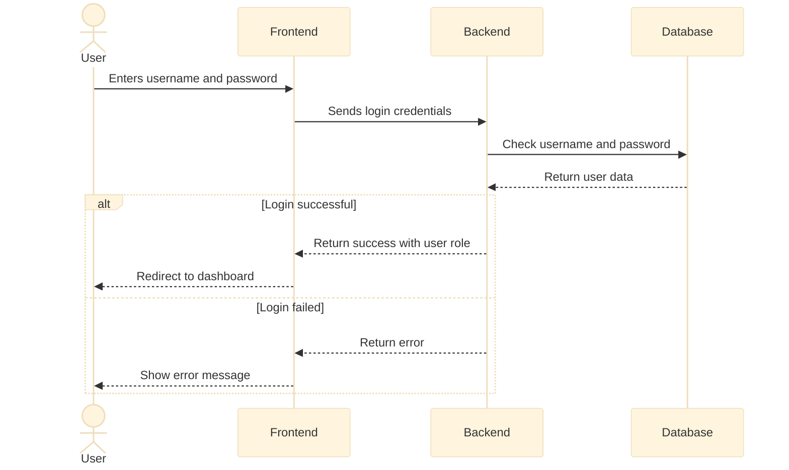
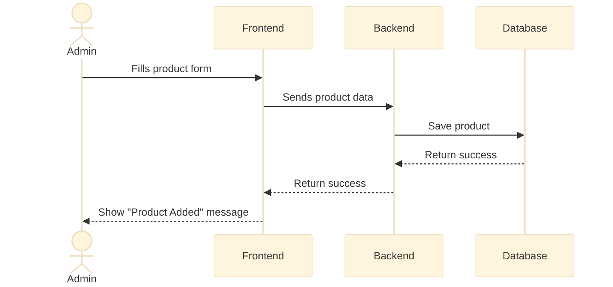
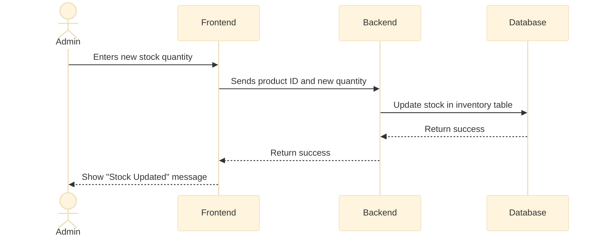
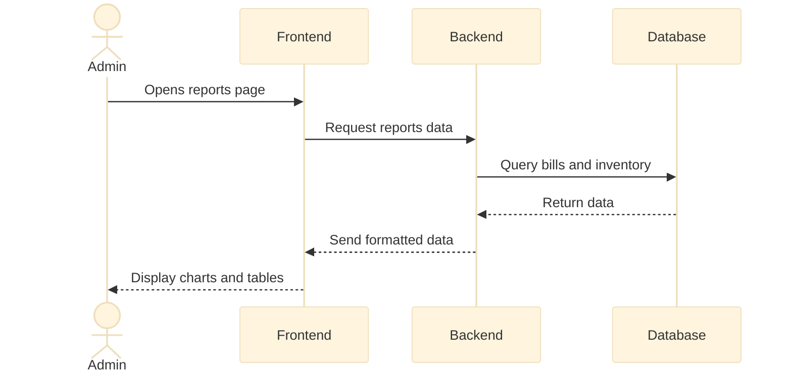

# Data Flow Diagrams

## 1. Bill Creation Flow

This shows the steps for creating a bill.

---

## 2. User Login Flow

This shows how a user logs in to the system.

---

## 3. Add New Product Flow

This shows how an Admin adds a new product.

---

## 4. Update Product Stock Flow

This shows how an Admin updates product stock.

---

## 5. View Reports Flow

This shows how an Admin views sales and inventory reports.

