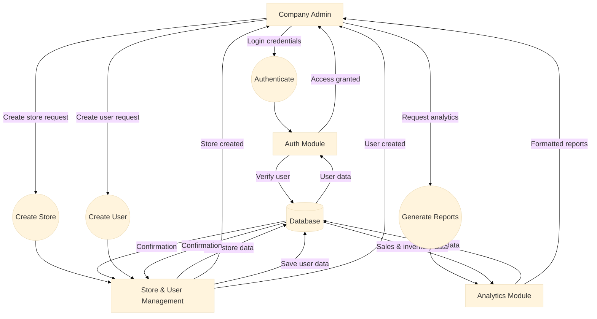
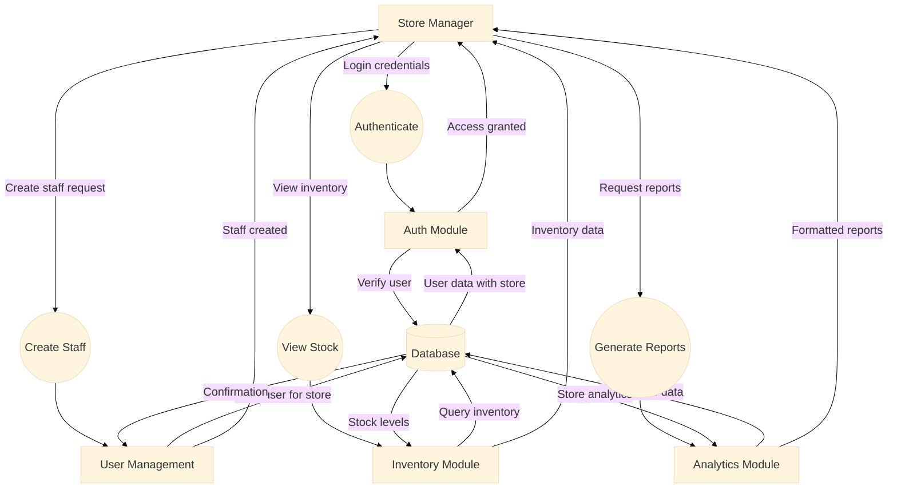
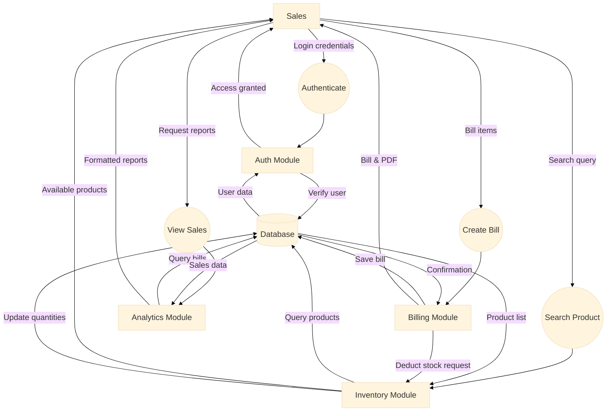
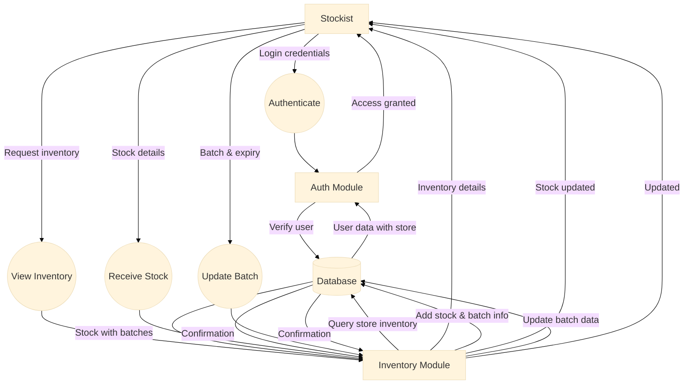
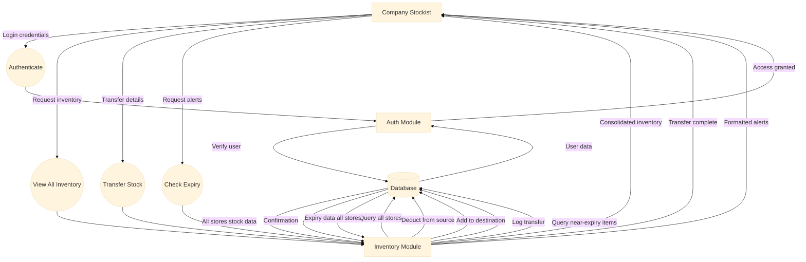

# System Data Flow

This document shows detailed data flow diagrams for each user role in the RetailPulse system.

---

## 1. Company Admin Data Flow

The Company Admin manages the entire system, including stores, users, and viewing all analytics.

**Key Functions:**
- Manage all stores (create, edit, delete)
- Manage all users across stores
- View company-wide analytics and reports
- Configure system settings

---

## 2. Store Manager Data Flow

The Store Manager oversees a specific store, manages store staff, and views store-level analytics.

**Key Functions:**
- Manage store staff (create Sales, Stockist users)
- View store inventory levels
- View store-specific sales analytics
- Monitor store performance

---

## 3. Sales Data Flow

The Sales user creates bills, searches for products, and handles customer transactions.

**Key Functions:**
- Search for products/medicines
- Create customer bills
- Generate PDF bills
- View own sales reports
- Process customer payments

---

## 4. Stockist Data Flow

The Stockist manages local store inventory, receives stock, and updates quantities.

**Key Functions:**
- View store inventory
- Receive new stock shipments
- Add products with batch and expiry details
- Update stock quantities
- Monitor stock levels and expiry dates

---

## 5. Company Stockist Data Flow

The Company Stockist oversees inventory across all stores and manages inter-store transfers.

**Key Functions:**
- View inventory across all stores
- Manage inter-store stock transfers
- Monitor company-wide stock levels
- Track expiry dates across all locations
- Optimize inventory distribution

---

## Summary

Each role has specific data flows tailored to their responsibilities:

| Role | Primary Functions | Key Modules Used |
|------|------------------|------------------|
| **Company Admin** | System management, company-wide analytics | Auth, Management, Analytics |
| **Store Manager** | Store staff management, store analytics | Auth, Management, Inventory, Analytics |
| **Sales** | Billing, product search, sales reports | Auth, Billing, Inventory, Analytics |
| **Stockist** | Local inventory management, stock receiving | Auth, Inventory |
| **Company Stockist** | Company-wide inventory, inter-store transfers | Auth, Inventory |