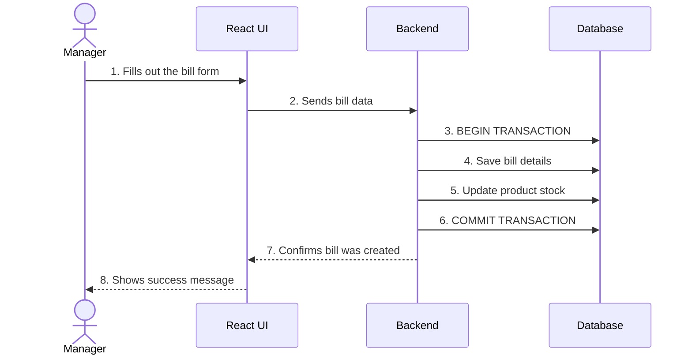

# Data Flow Diagrams

## 1. Bill Creation Flow

This shows the steps for creating a bill.

-   **Key Point**: The bill creation and stock update happen in a single, safe transaction. If one part fails, everything is undone.
