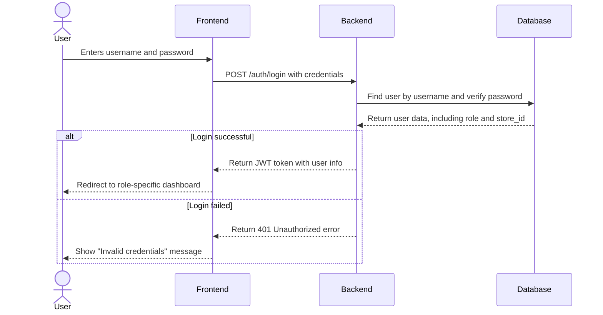
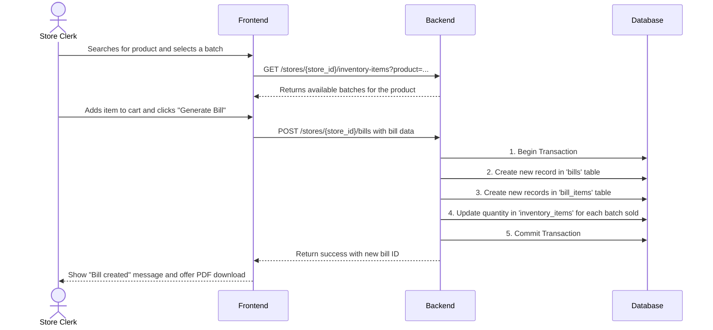
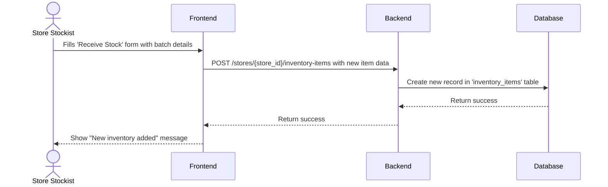
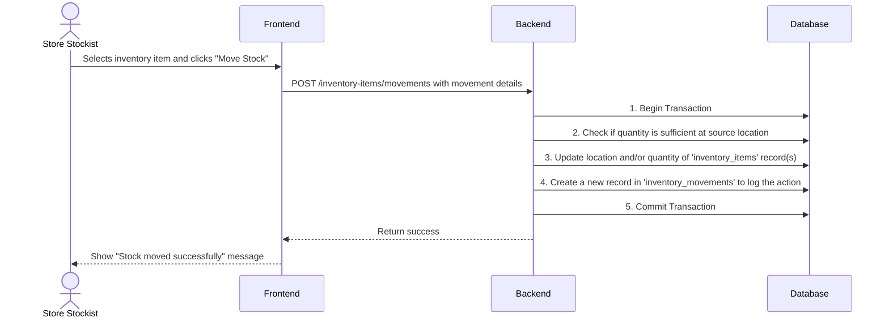
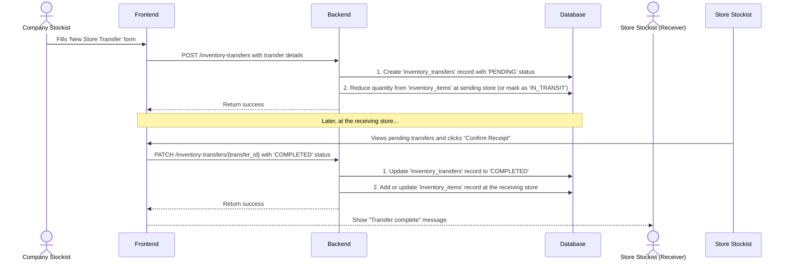
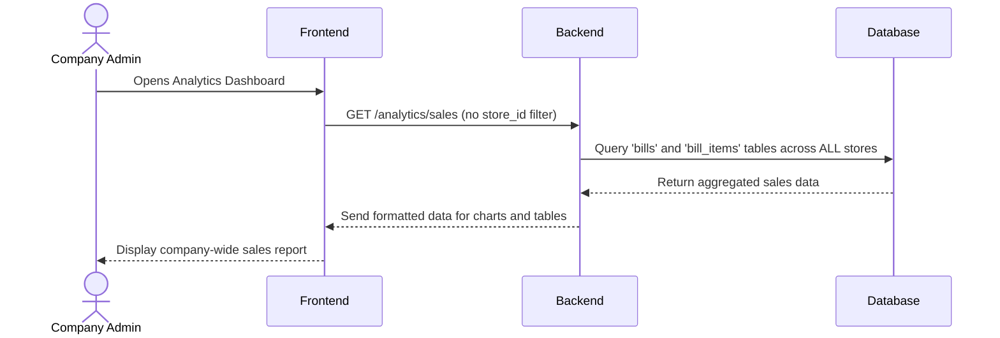

# Data Flow Diagrams

These diagrams illustrate the sequence of events for key processes in the system.

---

## 1. User Login Flow
*This flow is generic for any user role.*

---

## 2. Bill Creation Flow
*Shows a Store Clerk making a sale.*

---

## 3. Add New Inventory Batch Flow
*Shows a Store Stockist adding a new shipment.*

---

## 4. Internal Stock Movement Flow
*Shows a Store Stockist moving items from the storeroom to a shelf.*

---

## 5. Inter-Store Stock Transfer Flow
*Shows a Company Stockist sending stock from Store A to Store B.*

---

## 6. View Company-Wide Analytics Flow
*Shows a Company Admin viewing a sales report.*

