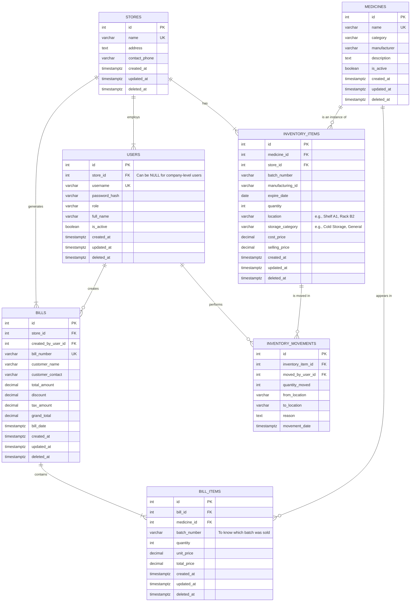

# Database Schema

## Overview

The system uses **PostgreSQL** as the database. The schema is designed to support a multi-store medical retail business, with detailed inventory tracking and role-based access for different user types.

It includes tables for managing stores, users, medicines, and a detailed inventory system that tracks pharmaceuticals by batch, expiry date, and location within each store. It also tracks financial transactions like bills and the movement of stock.

To ensure data integrity and history, all tables include `created_at`, `updated_at`, and `deleted_at` timestamps for soft deletes.

---

## Entity Relationship Diagram

---

## Database Tables

### 1. `stores`
Stores information for each retail store.

**Fields:**
- `id` (SERIAL PRIMARY KEY): Unique ID for the store.
- `name` (VARCHAR(255) UNIQUE NOT NULL): The name of the store (e.g., "Main Street Pharmacy").
- `address` (TEXT): Physical address of the store.
- `contact_phone` (VARCHAR(50)): Contact phone number for the store.
- `created_at` (TIMESTAMPTZ NOT NULL DEFAULT now()): Timestamp when the record was created.
- `updated_at` (TIMESTAMPTZ NOT NULL DEFAULT now()): Timestamp when the record was last updated.
- `deleted_at` (TIMESTAMPTZ): Timestamp for soft deletes.

### 2. `users`
Stores user login information and their roles.

**Fields:**
- `id` (SERIAL PRIMARY KEY): Unique user ID.
- `store_id` (INTEGER REFERENCES stores(id)): The store this user belongs to. Can be `NULL` for company-wide users (e.g., Company Admin).
- `username` (VARCHAR(100) UNIQUE NOT NULL): Login username.
- `password_hash` (VARCHAR(255) NOT NULL): Encrypted password.
- `role` (VARCHAR(50) NOT NULL): The user's role (e.g., 'company_admin', 'store_manager', 'clerk').
- `full_name` (VARCHAR(255)): User's full name.
- `is_active` (BOOLEAN NOT NULL DEFAULT true): Whether the user can log in.
- `created_at` (TIMESTAMPTZ NOT NULL DEFAULT now()): Timestamp when the record was created.
- `updated_at` (TIMESTAMPTZ NOT NULL DEFAULT now()): Timestamp when the record was last updated.
- `deleted_at` (TIMESTAMPTZ): Timestamp for soft deletes.

### 3. `medicines`
Stores general information about each medicine. This is the master catalog of all pharmaceuticals the company sells.

**Fields:**
- `id` (SERIAL PRIMARY KEY): Unique medicine ID.
- `name` (VARCHAR(255) UNIQUE NOT NULL): Medicine name.
- `category` (VARCHAR(100)): Medicine category (e.g., "Antibiotic", "Analgesic").
- `manufacturer` (VARCHAR(255)): Brand or manufacturer name.
- `description` (TEXT): Medicine details.
- `is_active` (BOOLEAN NOT NULL DEFAULT true): Whether the medicine is available for sale.
- `created_at` (TIMESTAMPTZ NOT NULL DEFAULT now()): Timestamp when the record was created.
- `updated_at` (TIMESTAMPTZ NOT NULL DEFAULT now()): Timestamp when the record was last updated.
- `deleted_at` (TIMESTAMPTZ): Timestamp for soft deletes.

### 4. `inventory_items`
This is the core inventory table. It tracks specific batches of medicines in specific stores and locations.

**Fields:**
- `id` (SERIAL PRIMARY KEY): Unique ID for this inventory item.
- `medicine_id` (INTEGER NOT NULL REFERENCES medicines(id)): The medicine this item refers to.
- `store_id` (INTEGER NOT NULL REFERENCES stores(id)): The store where this item is located.
- `batch_number` (VARCHAR(100)): The batch number for this group of items.
- `manufacturing_id` (VARCHAR(100)): The manufacturing ID, if available.
- `expire_date` (DATE): The expiration date of this batch.
- `quantity` (INTEGER NOT NULL CHECK (quantity >= 0)): The number of units in this batch at this location.
- `location` (VARCHAR(100)): The specific location in the store (e.g., "Shelf A1", "Cold Storage Room").
- `storage_category` (VARCHAR(100)): The type of storage required (e.g., "Cold Storage", "General").
- `cost_price` (DECIMAL(10, 2) NOT NULL): The purchase price per unit for this batch.
- `selling_price` (DECIMAL(10, 2) NOT NULL): The selling price per unit for this batch.
- `created_at` (TIMESTAMPTZ NOT NULL DEFAULT now()): Timestamp when the record was created.
- `updated_at` (TIMESTAMPTZ NOT NULL DEFAULT now()): Timestamp when the record was last updated.
- `deleted_at` (TIMESTAMPTZ): Timestamp for soft deletes.

### 5. `inventory_movements`
Logs the movement of inventory items from one location to another, creating an audit trail.

**Fields:**
- `id` (SERIAL PRIMARY KEY): Unique ID for the movement log.
- `inventory_item_id` (INTEGER NOT NULL REFERENCES inventory_items(id)): The inventory item that was moved.
- `moved_by_user_id` (INTEGER NOT NULL REFERENCES users(id)): The user who performed the movement.
- `quantity_moved` (INTEGER NOT NULL): The number of units moved.
- `from_location` (VARCHAR(100)): The location the items were moved from.
- `to_location` (VARCHAR(100)): The location the items were moved to.
- `reason` (TEXT): The reason for the movement (e.g., "Restocking shelf", "Store transfer").
- `movement_date` (TIMESTAMPTZ NOT NULL DEFAULT now()): When the movement occurred.

### 6. `bills`
Stores header information for each bill (receipt).

**Fields:**
- `id` (SERIAL PRIMARY KEY): Unique bill ID.
- `store_id` (INTEGER NOT NULL REFERENCES stores(id)): The store that issued the bill.
- `created_by_user_id` (INTEGER NOT NULL REFERENCES users(id)): The user who created the bill.
- `bill_number` (VARCHAR(100) UNIQUE NOT NULL): Unique bill number (e.g., "STORE1-BILL-00001").
- `customer_name` (VARCHAR(255)): Customer's name (e.g., "City Pharmacy").
- `customer_contact` (VARCHAR(100)): Customer's phone/email (optional).
- `total_amount` (DECIMAL(10, 2) NOT NULL): Sum of all items before discounts/taxes.
- `discount` (DECIMAL(10, 2) DEFAULT 0): Discount amount.
- `tax_amount` (DECIMAL(10, 2) DEFAULT 0): Tax/GST amount.
- `grand_total` (DECIMAL(10, 2) NOT NULL): Final amount to be paid.
- `bill_date` (TIMESTAMPTZ NOT NULL DEFAULT now()): The date and time the bill was created.
- `created_at` (TIMESTAMPTZ NOT NULL DEFAULT now()): Timestamp when the record was created.
- `updated_at` (TIMESTAMPTZ NOT NULL DEFAULT now()): Timestamp when the record was last updated.
- `deleted_at` (TIMESTAMPTZ): Timestamp for soft deletes.

### 7. `bill_items`
Stores the individual line items for each bill.

**Fields:**
- `id` (SERIAL PRIMARY KEY): Unique ID for the bill line item.
- `bill_id` (INTEGER NOT NULL REFERENCES bills(id)): The bill this item belongs to.
- `medicine_id` (INTEGER NOT NULL REFERENCES medicines(id)): The medicine that was sold.
- `batch_number` (VARCHAR(100)): The specific batch number of the item sold, for accurate tracking.
- `quantity` (INTEGER NOT NULL): Number of units sold.
- `unit_price` (DECIMAL(10, 2) NOT NULL): Price per unit at the time of sale.
- `total_price` (DECIMAL(10, 2) NOT NULL): `quantity` × `unit_price`.
- `created_at` (TIMESTAMPTZ NOT NULL DEFAULT now()): Timestamp when the record was created.
- `updated_at` (TIMESTAMPTZ NOT NULL DEFAULT now()): Timestamp when the record was last updated.
- `deleted_at` (TIMESTAMPTZ): Timestamp for soft deletes.
