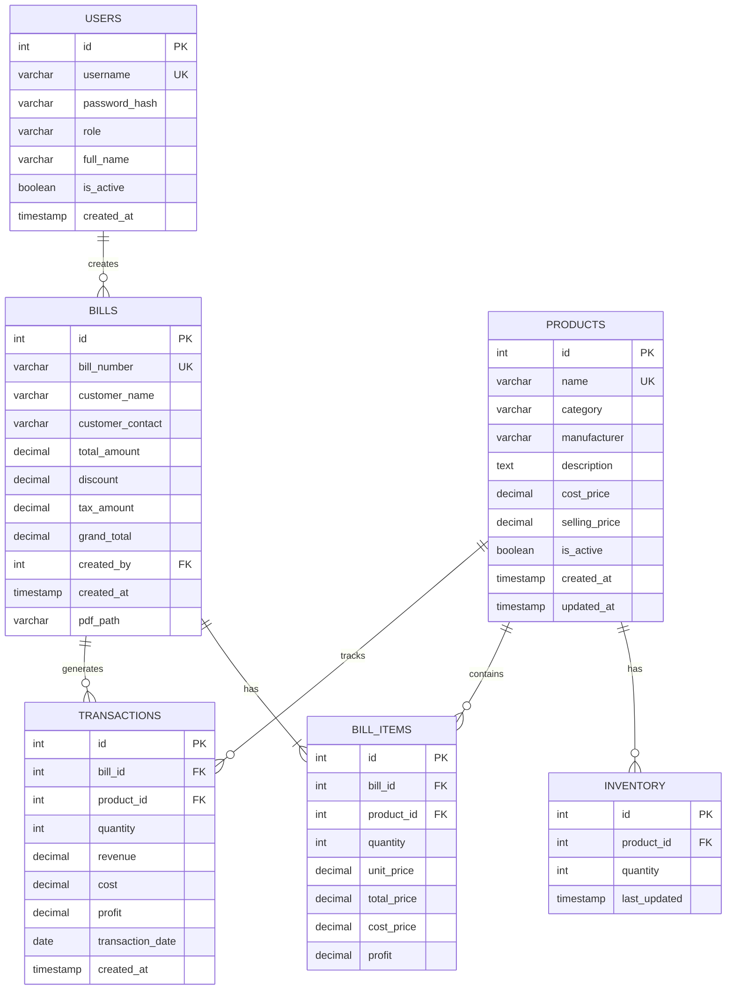

# Schema Design

## Database Overview

We use a PostgreSQL database to store all our data. It's reliable and keeps our information safe.

---

## Entity Relationship Diagram

This diagram shows how the different data tables are connected.



---

## Table Schemas

### 1. users

This table holds information for user login.

```sql
CREATE TABLE users (
    id              SERIAL PRIMARY KEY,
    username        VARCHAR(50) UNIQUE NOT NULL,
    password_hash   VARCHAR(255) NOT NULL,
    role            VARCHAR(20) NOT NULL CHECK (role IN ('admin', 'manager')),
    full_name       VARCHAR(100),
    is_active       BOOLEAN DEFAULT TRUE NOT NULL,
    created_at      TIMESTAMP DEFAULT NOW() NOT NULL
);
```

- `username`: The name a user types to log in.
- `password_hash`: The user's password, stored safely.
- `role`: What the user is allowed to do (admin or manager).

---

### 2. products

This table lists all the products we sell.

```sql
CREATE TABLE products (
    id              SERIAL PRIMARY KEY,
    name            VARCHAR(200) UNIQUE NOT NULL,
    category        VARCHAR(100),
    manufacturer    VARCHAR(100),
    description     TEXT,
    cost_price      DECIMAL(10,2) NOT NULL,
    selling_price   DECIMAL(10,2) NOT NULL,
    is_active       BOOLEAN DEFAULT TRUE NOT NULL,
    created_at      TIMESTAMP DEFAULT NOW() NOT NULL,
    updated_at      TIMESTAMP DEFAULT NOW() NOT NULL
);
```

- `name`: The product's name.
- `cost_price`: How much we pay for the product.
- `selling_price`: How much we sell the product for.

---

### 3. inventory

This table tracks the stock level for each product.

```sql
CREATE TABLE inventory (
    id              SERIAL PRIMARY KEY,
    product_id      INTEGER NOT NULL REFERENCES products(id) ON DELETE RESTRICT,
    quantity        INTEGER NOT NULL DEFAULT 0,
    last_updated    TIMESTAMP DEFAULT NOW() NOT NULL
);
```

- `product_id`: Links to the product.
- `quantity`: How much stock is currently available.

---

### 4. bills

This table stores the main details of each customer bill.

```sql
CREATE TABLE bills (
    id                  SERIAL PRIMARY KEY,
    bill_number         VARCHAR(50) UNIQUE NOT NULL,
    customer_name       VARCHAR(100),
    customer_contact    VARCHAR(20),
    total_amount        DECIMAL(10,2) NOT NULL,
    discount            DECIMAL(10,2) DEFAULT 0,
    tax_amount          DECIMAL(10,2) DEFAULT 0,
    grand_total         DECIMAL(10,2) NOT NULL,
    created_by          INTEGER NOT NULL REFERENCES users(id),
    created_at          TIMESTAMP DEFAULT NOW() NOT NULL,
    pdf_path            VARCHAR(255)
);
```

- `bill_number`: A unique number for the bill.
- `customer_name`: The customer's name (optional).
- `grand_total`: The final amount the customer pays.
- `created_by`: The user who made this bill.

---

### 5. bill_items

This table lists each product sold within a bill.

```sql
CREATE TABLE bill_items (
    id              SERIAL PRIMARY KEY,
    bill_id         INTEGER NOT NULL REFERENCES bills(id) ON DELETE CASCADE,
    product_id      INTEGER NOT NULL REFERENCES products(id),
    quantity        INTEGER NOT NULL,
    unit_price      DECIMAL(10,2) NOT NULL,
    total_price     DECIMAL(10,2) NOT NULL,
    cost_price      DECIMAL(10,2),
    profit          DECIMAL(10,2) GENERATED ALWAYS AS (total_price - (cost_price * quantity)) STORED
);
```

- `bill_id`: Links to the bill this item is part of.
- `product_id`: Links to the product that was sold.
- `quantity`: How many units of the product were sold.
- `profit`: The profit made on this item.

---

### 6. transactions

This table is a simplified record of sales, used for quick reports.

```sql
CREATE TABLE transactions (
    id                  SERIAL PRIMARY KEY,
    bill_id             INTEGER NOT NULL REFERENCES bills(id) ON DELETE CASCADE,
    product_id          INTEGER NOT NULL REFERENCES products(id),
    quantity            INTEGER NOT NULL,
    revenue             DECIMAL(10,2) NOT NULL,
    cost                DECIMAL(10,2) NOT NULL,
    profit              DECIMAL(10,2) NOT NULL,
    transaction_date    DATE NOT NULL,
    created_at          TIMESTAMP DEFAULT NOW() NOT NULL
);
```

- `product_id`: Which product was sold.
- `quantity`: How many units were sold.
- `revenue`: The money earned from this sale.
- `profit`: The profit from this sale.
- `transaction_date`: The date of the sale.

---

## Summary

This database design is simple and focuses on the core needs of the application: creating bills, managing stock, and seeing reports.