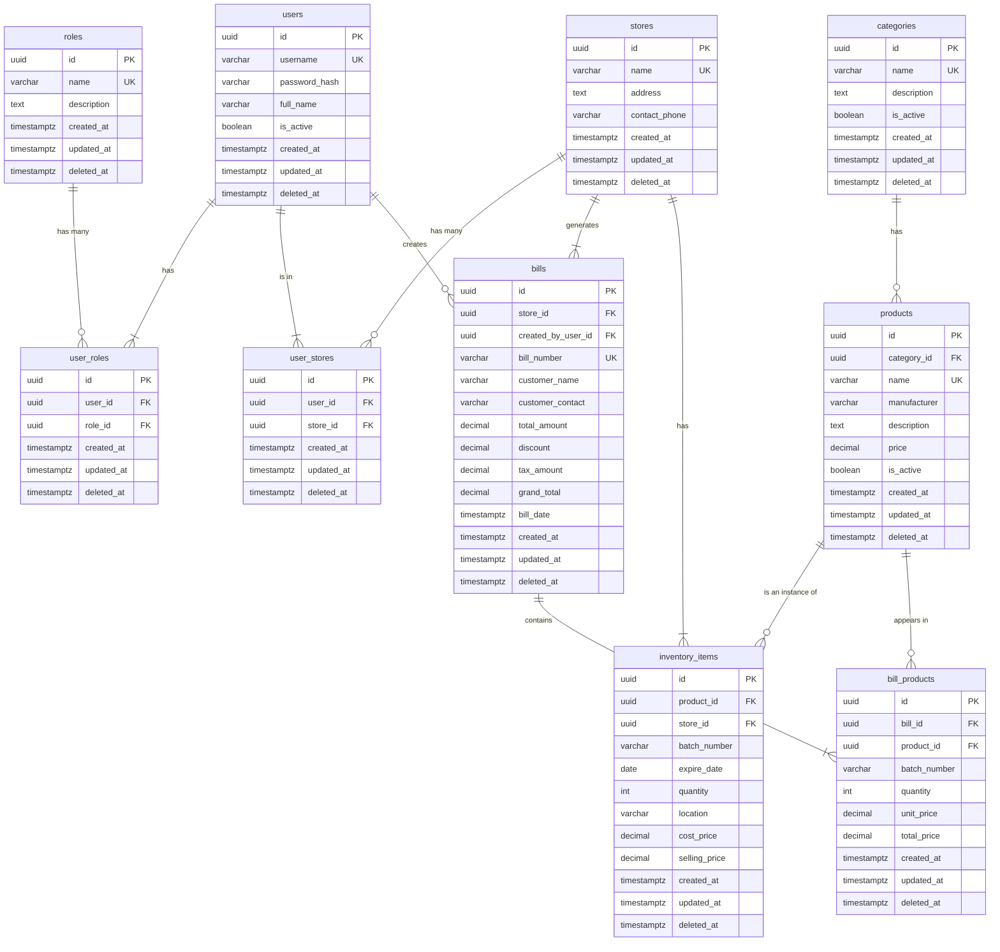

# Database Schema

## Overview

The system uses **PostgreSQL** for its ACID compliance, strong relational support, and efficient handling of complex joins needed for multi-store inventory and RBAC.

Users can have multiple roles and work across multiple stores via junction tables (`user_stores` and `user_roles`). All tables use soft deletes with `created_at`, `updated_at`, and `deleted_at` timestamps.

## Why PostgreSQL

- **ACID compliance**: Financial and inventory transactions require guaranteed consistency
- **Complex relationships**: Multiple many-to-many relationships (users-roles, users-stores, bills-products)
- **Structured data**: Product details, batches, pricing, and transactions are inherently structured
- **SQL querying**: Efficient aggregations and reporting on relational data
- **RBAC support**: Natural fit for role-permission modeling

---

## Entity Relationship Diagram

---

## Database Tables

### `stores`

Store locations with name, address, and contact info.

### `users`

Central user records with username, password hash, and full name. Roles and stores assigned via junction tables.

### `roles`

Defines available roles (Company Admin, Store Manager, Sales, Stockist, Company Stockist).

### `user_roles`

Junction table linking users to roles (many-to-many).

### `user_stores`

Junction table linking users to stores (many-to-many).

### `categories`

Product categories with name and description for organizing products.

### `products`

Master product catalog with category reference, name, manufacturer, and description.

### `inventory_items`

Batch-level inventory tracking per store with expiry dates, quantities, location, and pricing.

### `bills`

Bill headers with store, user, bill number, customer details, and totals.

### `bill_products`

Bill line items with product, quantity, pricing, and batch number for inventory tracking.

## Indexing Strategy

**Auto-created indexes:**

- Primary keys (all tables)
- Unique constraints (`username`, `bill_number`, product/role/permission `name`)

**Explicit B-tree indexes on:**

**Foreign keys** (for JOIN performance):

- `user_roles`: `user_id`, `role_id`
- `user_stores`: `user_id`, `store_id`
- `products`: `category_id`
- `inventory_items`: `product_id`, `store_id`
- `bills`: `store_id`, `created_by_user_id`
- `bill_products`: `bill_id`, `product_id`

**Query-heavy columns:**

- `inventory_items.expire_date` - frequent expiry checks and range queries
- `inventory_items.batch_number` - batch-specific searches
- `categories.name` - filtering by category
- `products.manufacturer` - filtering by manufacturer
- `bills.bill_date` - date-based reporting

**Why B-tree:**
Handles equality, range queries, sorting, and pattern matching efficiently - covers all common query patterns in the system.
