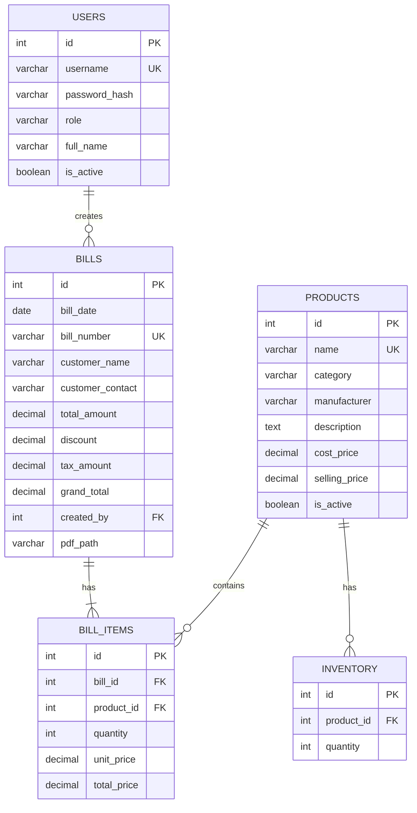

# Database Schema

## Overview

The system uses **PostgreSQL** as the database. It has 5 simple tables to manage users, products, inventory, bills, and bill items.

---

## Entity Relationship Diagram

---

## Database Tables

### 1. users
Stores user login information.

**Fields:**

- `id` - Unique user ID
- `username` - Login username
- `password_hash` - Encrypted password
- `role` - Either 'admin' or 'manager'
- `full_name` - User's full name
- `is_active` - Whether user can login

---

### 2. products
Stores all product information.

**Fields:**

- `id` - Unique product ID
- `name` - Product name
- `category` - Product category (e.g., Tablets, Syrup)
- `manufacturer` - Brand/manufacturer name
- `description` - Product details
- `cost_price` - Purchase price
- `selling_price` - Selling price
- `is_active` - Whether product is available

---

### 3. inventory
Tracks stock quantity for each product.

**Fields:**

- `id` - Unique inventory ID
- `product_id` - Links to products table
- `quantity` - Current stock level

---

### 4. bills
Stores bill information.

**Fields:**

- `id` - Unique bill ID
- `bill_number` - Unique bill number (e.g., BILL-001)
- `bill_date` - Date of bill
- `customer_name` - Customer name (optional)
- `customer_contact` - Customer phone/email (optional)
- `total_amount` - Sum of all items
- `discount` - Discount amount
- `tax_amount` - Tax/GST amount
- `grand_total` - Final amount to pay
- `created_by` - User who created the bill
- `pdf_path` - Location of PDF file

---

### 5. bill_items
Stores individual items in each bill.

**Fields:**

- `id` - Unique item ID
- `bill_id` - Links to bills table
- `product_id` - Links to products table
- `quantity` - Number of units sold
- `unit_price` - Price per unit
- `total_price` - quantity × unit_price
