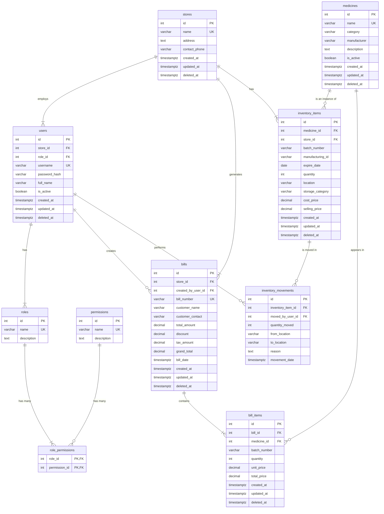

# Database Schema

## Overview

The system uses **PostgreSQL** as the database. The schema is designed to support a multi-store medical retail business, with detailed inventory tracking and a flexible Role-Based Access Control (RBAC) system.

The RBAC system is composed of `roles`, `permissions`, and a `role_permissions` junction table. This allows for granular control over user actions, making the system scalable and easy to manage.

To ensure data integrity and history, all tables include `created_at`, `updated_at`, and `deleted_at` timestamps for soft deletes.

---

## Entity Relationship Diagram

---

## Database Tables

### 1. `stores`
Stores information for each retail store.

**Fields:**

- `id` (SERIAL PRIMARY KEY): Unique ID for the store.
- `name` (VARCHAR(255) UNIQUE NOT NULL): The name of the store (e.g., "Main Street Pharmacy").
- `address` (TEXT): Physical address of the store.
- `contact_phone` (VARCHAR(50)): Contact phone number for the store.
- `created_at` (TIMESTAMPTZ NOT NULL DEFAULT now()): Timestamp when the record was created.
- `updated_at` (TIMESTAMPTZ NOT NULL DEFAULT now()): Timestamp when the record was last updated.
- `deleted_at` (TIMESTAMPTZ): Timestamp for soft deletes.

### 2. `users`
Stores user login information and their assigned role.

**Fields:**

- `id` (SERIAL PRIMARY KEY): Unique user ID.
- `store_id` (INTEGER REFERENCES stores(id)): The store this user belongs to. Can be `NULL` for company-wide users.
- `role_id` (INTEGER NOT NULL REFERENCES roles(id)): The role assigned to this user.
- `username` (VARCHAR(100) UNIQUE NOT NULL): Login username.
- `password_hash` (VARCHAR(255) NOT NULL): Encrypted password.
- `full_name` (VARCHAR(255)): User's full name.
- `is_active` (BOOLEAN NOT NULL DEFAULT true): Whether the user can log in.
- `created_at` (TIMESTAMPTZ NOT NULL DEFAULT now()): Timestamp when the record was created.
- `updated_at` (TIMESTAMPTZ NOT NULL DEFAULT now()): Timestamp when the record was last updated.
- `deleted_at` (TIMESTAMPTZ): Timestamp for soft deletes.

### 3. `roles`
Defines the user roles available in the system.

**Fields:**

- `id` (SERIAL PRIMARY KEY): Unique ID for the role.
- `name` (VARCHAR(50) UNIQUE NOT NULL): The name of the role (e.g., 'Company Admin', 'Store Manager', 'Sales').
- `description` (TEXT): A brief description of the role.

### 4. `permissions`
Defines granular permissions for actions within the system.

**Fields:**

- `id` (SERIAL PRIMARY KEY): Unique ID for the permission.
- `name` (VARCHAR(100) UNIQUE NOT NULL): The name of the permission (e.g., 'bills.create', 'analytics.view.all').
- `description` (TEXT): A brief description of what the permission allows.

### 5. `role_permissions`
A junction table that assigns permissions to roles, creating a many-to-many relationship.

**Fields:**

- `role_id` (INTEGER NOT NULL REFERENCES roles(id)): The role being assigned a permission.
- `permission_id` (INTEGER NOT NULL REFERENCES permissions(id)): The permission being granted.
- PRIMARY KEY (`role_id`, `permission_id`): Ensures each permission is assigned to a role only once.

### 6. `medicines`
Stores general information about each medicine. This is the master catalog of all pharmaceuticals the company sells.

**Fields:**

- `id` (SERIAL PRIMARY KEY): Unique medicine ID.
- `name` (VARCHAR(255) UNIQUE NOT NULL): Medicine name.
- `category` (VARCHAR(100)): Medicine category (e.g., "Antibiotic", "Analgesic").
- `manufacturer` (VARCHAR(255)): Brand or manufacturer name.
- `description` (TEXT): Medicine details.
- `is_active` (BOOLEAN NOT NULL DEFAULT true): Whether the medicine is available for sale.
- `created_at` (TIMESTAMPTZ NOT NULL DEFAULT now()): Timestamp when the record was created.
- `updated_at` (TIMESTAMPTZ NOT NULL DEFAULT now()): Timestamp when the record was last updated.
- `deleted_at` (TIMESTAMPTZ): Timestamp for soft deletes.

### 7. `inventory_items`
This is the core inventory table. It tracks specific batches of medicines in specific stores and locations.

**Fields:**

- `id` (SERIAL PRIMARY KEY): Unique ID for this inventory item.
- `medicine_id` (INTEGER NOT NULL REFERENCES medicines(id)): The medicine this item refers to.
- `store_id` (INTEGER NOT NULL REFERENCES stores(id)): The store where this item is located.
- `batch_number` (VARCHAR(100)): The batch number for this group of items.
- `manufacturing_id` (VARCHAR(100)): The manufacturing ID, if available.
- `expire_date` (DATE): The expiration date of this batch.
- `quantity` (INTEGER NOT NULL CHECK (quantity >= 0)): The number of units in this batch at this location.
- `location` (VARCHAR(100)): The specific location in the store (e.g., "Shelf A1", "Cold Storage Room").
- `storage_category` (VARCHAR(100)): The type of storage required (e.g., "Cold Storage", "General").
- `cost_price` (DECIMAL(10, 2) NOT NULL): The purchase price per unit for this batch.
- `selling_price` (DECIMAL(10, 2) NOT NULL): The selling price per unit for this batch.
- `created_at` (TIMESTAMPTZ NOT NULL DEFAULT now()): Timestamp when the record was created.
- `updated_at` (TIMESTAMPTZ NOT NULL DEFAULT now()): Timestamp when the record was last updated.
- `deleted_at` (TIMESTAMPTZ): Timestamp for soft deletes.

### 8. `inventory_movements`
Logs the movement of inventory items from one location to another, creating an audit trail.

**Fields:**

- `id` (SERIAL PRIMARY KEY): Unique ID for the movement log.
- `inventory_item_id` (INTEGER NOT NULL REFERENCES inventory_items(id)): The inventory item that was moved.
- `moved_by_user_id` (INTEGER NOT NULL REFERENCES users(id)): The user who performed the movement.
- `quantity_moved` (INTEGER NOT NULL): The number of units moved.
- `from_location` (VARCHAR(100)): The location the items were moved from.
- `to_location` (VARCHAR(100)): The location the items were moved to.
- `reason` (TEXT): The reason for the movement (e.g., "Restocking shelf", "Store transfer").
- `movement_date` (TIMESTAMPTZ NOT NULL DEFAULT now()): When the movement occurred.

### 9. `bills`
Stores header information for each bill (receipt).

**Fields:**

- `id` (SERIAL PRIMARY KEY): Unique bill ID.
- `store_id` (INTEGER NOT NULL REFERENCES stores(id)): The store that issued the bill.
- `created_by_user_id` (INTEGER NOT NULL REFERENCES users(id)): The user who created the bill.
- `bill_number` (VARCHAR(100) UNIQUE NOT NULL): Unique bill number (e.g., "STORE1-BILL-00001").
- `customer_name` (VARCHAR(255)): Customer's name (e.g., "City Pharmacy").
- `customer_contact` (VARCHAR(100)): Customer's phone/email (optional).
- `total_amount` (DECIMAL(10, 2) NOT NULL): Sum of all items before discounts/taxes.
- `discount` (DECIMAL(10, 2) DEFAULT 0): Discount amount.
- `tax_amount` (DECIMAL(10, 2) DEFAULT 0): Tax/GST amount.
- `grand_total` (DECIMAL(10, 2) NOT NULL): Final amount to be paid.
- `bill_date` (TIMESTAMPTZ NOT NULL DEFAULT now()): The date and time the bill was created.
- `created_at` (TIMESTAMPTZ NOT NULL DEFAULT now()): Timestamp when the record was created.
- `updated_at` (TIMESTAMPTZ NOT NULL DEFAULT now()): Timestamp when the record was last updated.
- `deleted_at` (TIMESTAMPTZ): Timestamp for soft deletes.

### 10. `bill_items`
Stores the individual line items for each bill.

**Fields:**

- `id` (SERIAL PRIMARY KEY): Unique ID for the bill line item.
- `bill_id` (INTEGER NOT NULL REFERENCES bills(id)): The bill this item belongs to.
- `medicine_id` (INTEGER NOT NULL REFERENCES medicines(id)): The medicine that was sold.
- `batch_number` (VARCHAR(100)): The specific batch number of the item sold, for accurate tracking.
- `quantity` (INTEGER NOT NULL): Number of units sold.
- `unit_price` (DECIMAL(10, 2) NOT NULL): Price per unit at the time of sale.
- `total_price` (DECIMAL(10, 2) NOT NULL): `quantity` × `unit_price`.
- `created_at` (TIMESTAMPTZ NOT NULL DEFAULT now()): Timestamp when the record was created.
- `updated_at` (TIMESTAMPTZ NOT NULL DEFAULT now()): Timestamp when the record was last updated.
- `deleted_at` (TIMESTAMPTZ): Timestamp for soft deletes.

