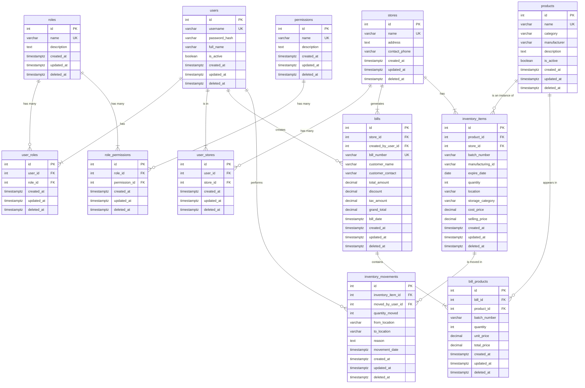

# Database Schema

## Overview

The system uses **PostgreSQL** as the database. The schema is designed to support a multi-store medical retail business, with detailed inventory tracking and a flexible Role-Based Access Control (RBAC) system.

To ensure data integrity and history, all tables include `created_at`, `updated_at`, and `deleted_at` timestamps for soft deletes.

---

## Entity Relationship Diagram

---

## Database Tables

### `stores`
The `stores` table contains a record for each retail store location. It includes a unique `id`, the store's `name`, `address`, and `contact_phone`. Timestamps for creation, updates, and soft deletes are included.

### `users`
The `users` table is the central record for every person who can log in to the system. It contains a unique `id`, `username`, `password_hash`, `full_name`, and an `is_active` flag. A user's roles and store assignments are managed in separate junction tables, so this table does not contain `role_id` or `store_id`. It also includes `created_at`, `updated_at`, and `deleted_at` timestamps.

### `roles`
The `roles` table defines the user roles available in the system. It has a unique `id` and a `name` for the role (e.g., 'Company Admin', 'Store Manager', 'Sales'), along with a `description`. It also includes `created_at`, `updated_at`, and `deleted_at` timestamps.

### `user_roles`
This is a junction table that assigns roles to users, creating a many-to-many relationship. It links `user_id` to `role_id`, allowing a single user to have multiple roles (e.g., a user could be both a 'Store Manager' and 'Sales'). It also includes `created_at`, `updated_at`, and `deleted_at` timestamps.

### `permissions`
The `permissions` table defines granular permissions for actions within the system. It has a unique `id` and a `name` for the permission (e.g., 'bills.create', 'analytics.view.all'), with a `description` of what it allows. It also includes `created_at`, `updated_at`, and `deleted_at` timestamps.

### `role_permissions`
This is a junction table that assigns permissions to roles, creating a many-to-many relationship. It links `role_id` to `permission_id`, ensuring each permission is assigned to a role only once. It also includes `created_at`, `updated_at`, and `deleted_at` timestamps.

### `user_stores`
This is a junction table that assigns users to stores, creating a many-to-many relationship. It links `user_id` to `store_id`, allowing a single user to be associated with multiple stores. It also includes `created_at`, `updated_at`, and `deleted_at` timestamps.

### `products`
The `products` table is the master catalog of all products the company sells. It contains the product's `id`, `name`, `category`, `manufacturer`, `description`, and an `is_active` flag. It also includes `created_at`, `updated_at`, and `deleted_at` timestamps.

### `inventory_items`
This is the core inventory table, tracking specific batches of products in specific stores and locations. It links to `products` and `stores` and includes a `batch_number`, `manufacturing_id`, `expire_date`, `quantity`, `location`, `storage_category`, `cost_price`, and `selling_price`. It also includes `created_at`, `updated_at`, and `deleted_at` timestamps.

### `inventory_movements`
The `inventory_movements` table logs the movement of inventory items from one location to another, creating an audit trail. It records the `inventory_item_id`, the `moved_by_user_id`, `quantity_moved`, `from_location`, `to_location`, a `reason`, and the `movement_date`. It also includes `created_at`, `updated_at`, and `deleted_at` timestamps.

### `bills`
The `bills` table stores header information for each bill (receipt). It is linked to the `stores` where it was created and the `users` who created it. It also contains a unique `bill_number`, customer details, and financial totals (`total_amount`, `discount`, `tax_amount`, `grand_total`). It also includes `created_at`, `updated_at`, and `deleted_at` timestamps.

### `bill_products`
The `bill_products` table stores the individual line items for each bill. It links to the `bills` table and the specific `products` sold. It includes the `quantity`, `unit_price`, `total_price`, and the `batch_number` of the item sold for accurate inventory tracking. It also includes `created_at`, `updated_at`, and `deleted_at` timestamps.